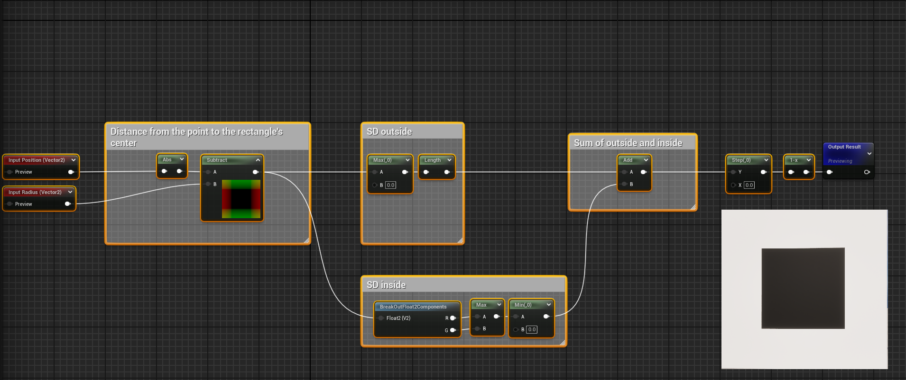

# SDF Mask Material Function Library
Unreal Engine has limited mask library for materials. This library is created to enhance mask library & document shader programming foundation.

<b>SDF</b> - a signed distance field. A signed distance field in general is the result of a signed distance transformation applied to a subset of N-dimensional space. it maps each point P of the space to a scalar signed distance value.

## Circle Mask without fade Function
<picture>
  <source media="(prefers-color-scheme: dark)" srcset="Images/CircleFunctionDemo.png">
  <source media="(prefers-color-scheme: light)" srcset="Images/CircleFunctionDemo.png">
  
</picture>

Details of this function

### Length
To calculate the distance from the point to the origin.

### Substract
Subtract the radius to get the signed distance to the circle's surface.

### Step
Function to remove all values between 0 and 1. To remove fading effect.
  

## Rectangle Mask without fade Function
<picture>
  <source media="(prefers-color-scheme: dark)" srcset="Images/RectangleFunctionDemo.png">
  <source media="(prefers-color-scheme: light)" srcset="Images/RectangleFunctionDemo.png">
  
</picture>
