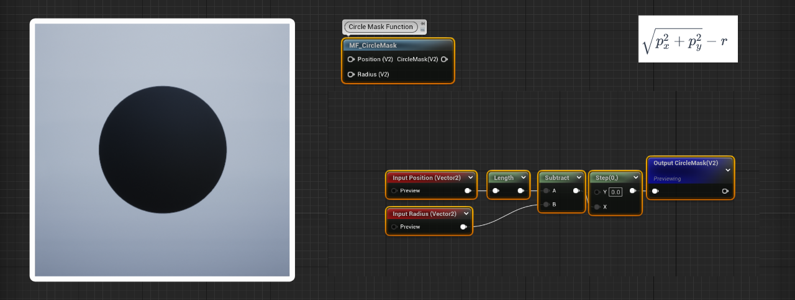

# Material Masks Function Library
Unreal Engine has limited mask library for materials. This library is created to enhance mask library & document shader programming foundation.
## Circle Mask without fade Function
<picture>
  <source media="(prefers-color-scheme: dark)" srcset="Images/CircleFunctionDemo.png">
  <source media="(prefers-color-scheme: light)" srcset="Images/CircleFunctionDemo.png">
  
</picture>
